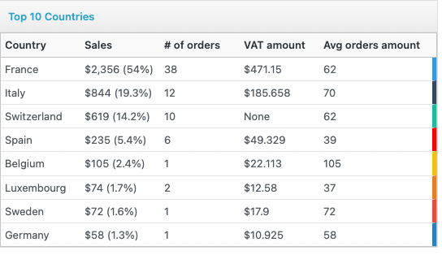

# Sales Report By Country for WooCommerce

This plugin is originally by zorem: 

> "This plugin simply adds a report tab to display sales report by country WooCommerce Reports. The plugin adds an additional report tab which display sales report by country. You’ll find this report available in WooCommerce reports section.". 

I simply modified it to add VAT/Tax support to it.

Here an example:

